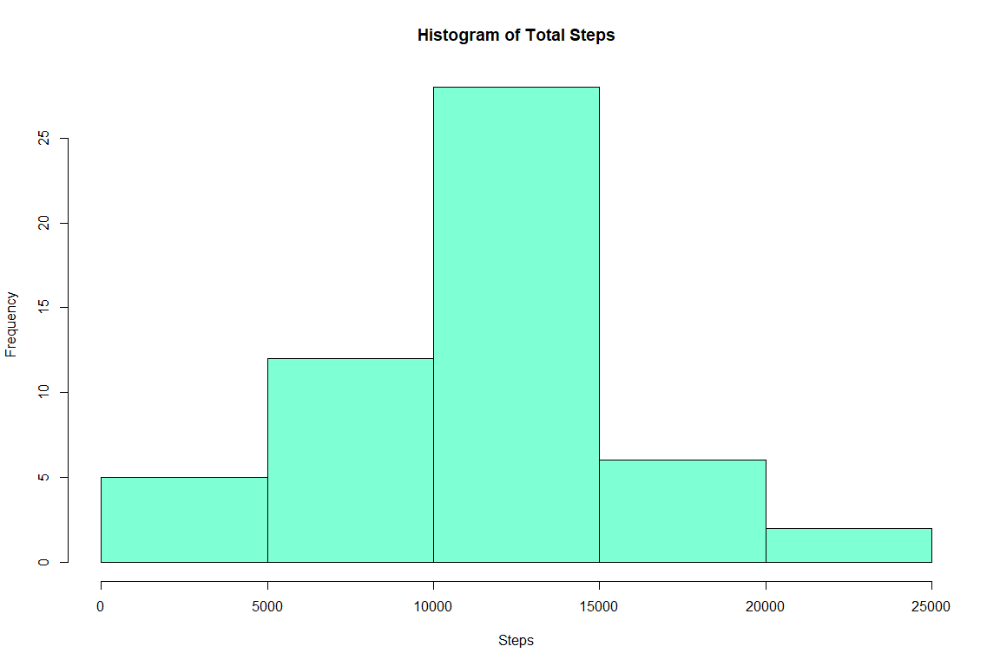
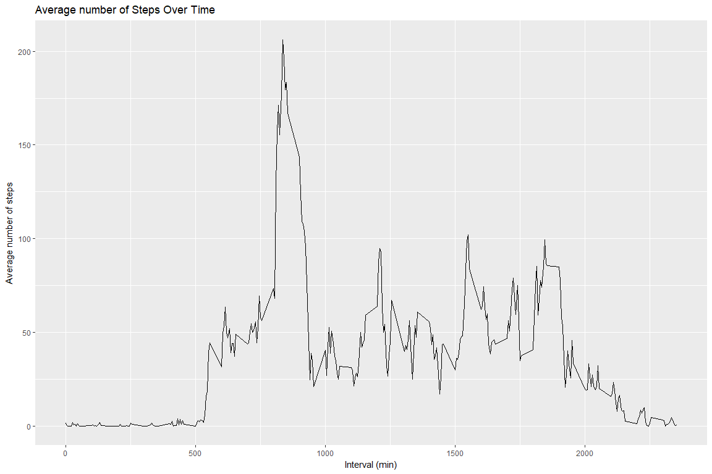
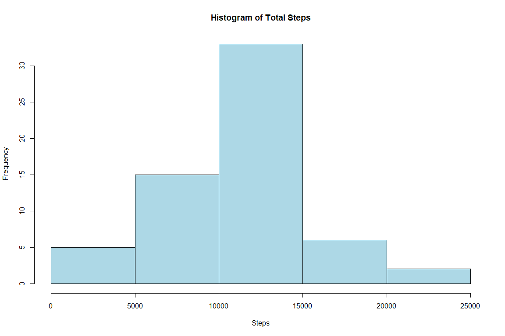
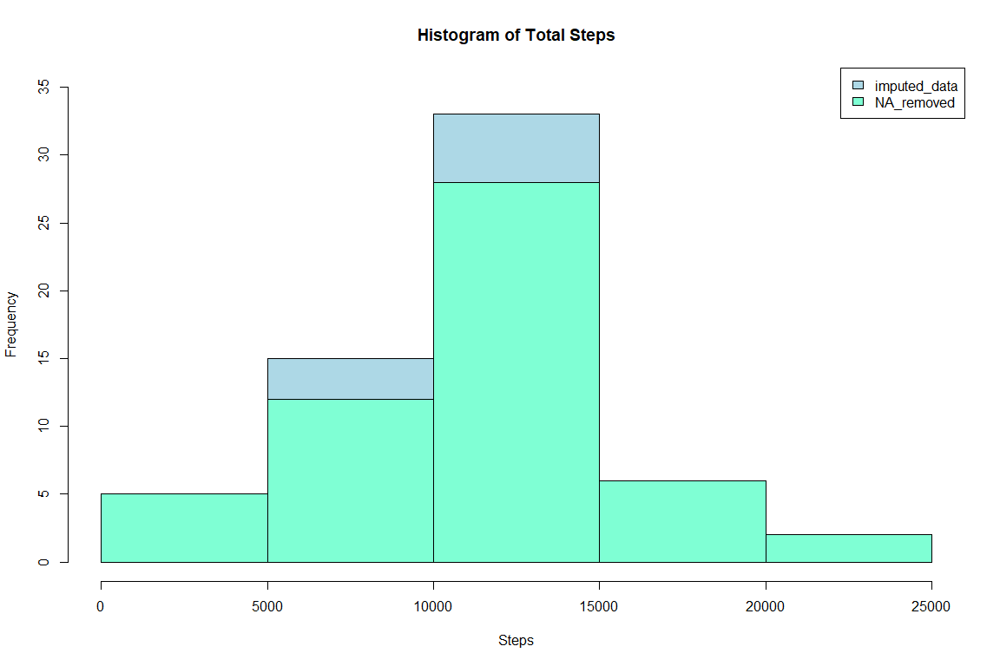
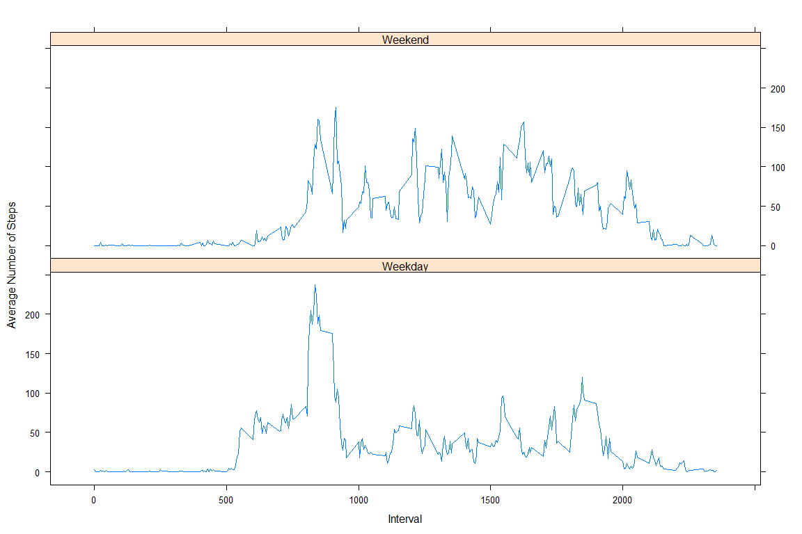

Project 1 of the Reproducible Research Coursera Class requested that we analyze data of fitness tracker measurements. The measurements are step counts taken at intervals of 5 minutes for a subject.

## Loading and preprocessing the data

The first step of this is to read in the data needed for the analysis.


```r
if(file.exists("C:\\Users\\sujat\\Documents\\R_Coding\\ReproducibleResearch\\Week2_project")) {
outDir <- "C:\\Users\\sujat\\Documents\\R_Coding\\ReproducibleResearch\\Week2_project\\data";
unzip("C:\\Users\\sujat\\Documents\\R_Coding\\ReproducibleResearch\\Week2_project\\activity.zip", 
      exdir = outDir)}

data <- read.csv("C:\\Users\\sujat\\Documents\\R_Coding\\ReproducibleResearch\\Week2_project\\data\\activity.csv")
```

###Cleaning up the data

The data required a little bit of cleaning up by changing the format of the data (dates to be Date Objects, day of the week), and not including the data without a value for steps (NA). 


```r
library(lubridate)
```

```
## 
## Attaching package: 'lubridate'
```

```
## The following object is masked from 'package:base':
## 
##     date
```

```r
data$date <- as.Date(as.character(data$date))
data$day <- weekdays(data$date) 
cleandata <- data[!is.na(data$steps),]

## making a simpler table of just the steps and the date from cleandata
smallTable <- aggregate(cleandata$steps ~ cleandata$date, FUN = sum)
names(smallTable) <- c("date", "steps")
```

Here I've created a histogram of the total number of steps by interval of time:


```r
hist(smallTable$steps, breaks = 5, xlab = "Steps", col = "aquamarine", main = "Histogram of Total Steps")
```

<!-- -->

## What is mean total number of steps taken per day?
The data of the steps can be summarized by the mean steps/day (10766) and median steps per day (10765).


```r
meantotsteps <- as.integer(mean(smallTable$steps))
print(paste("Mean of steps: ", meantotsteps))
```

```
## [1] "Mean of steps:  10766"
```

```r
mediantotsteps <- median(smallTable$steps)
print(paste("Median steps: ", mediantotsteps))
```

```
## [1] "Median steps:  10765"
```

## What is the average daily activity pattern?

Employing ddply(), I've created a new dataframe with a new a column variable for Average steps. So that I can create a plot of a timeseries of the steps data.


```r
library(plyr)
```

```
## 
## Attaching package: 'plyr'
```

```
## The following object is masked from 'package:lubridate':
## 
##     here
```

```r
timeseries <- ddply(cleandata, .(interval), summarize, 
                    Avg = mean(steps))
```


```r
library(ggplot2)
g <- ggplot(timeseries, aes(interval, Avg)) + geom_line() + 
    labs(title = "Average number of Steps Over Time", x = "Interval (min)", y = "Average number of steps")
print(g)
```

<!-- -->

The maximum average steps are taken during a particular interval:


```r
maxstepsInt <- timeseries$interval[which(timeseries$Avg == max(timeseries$Avg))]
print(paste("Maximum steps on average found at interval time: ", maxstepsInt))
```

```
## [1] "Maximum steps on average found at interval time:  835"
```

## Imputing Missing Values

One consideration to make when processing data is whether to impute missing values and how to impute them. 

I decided to impute missing values by assigning the missing steps value the average steps value for that particular day. Then, I created a histogram of the sum of steps by interval, with the data after the missing values were imputed.


```r
dirty_data <- is.na(data$steps)
print(paste("Number of rows of mising data: ", sum(dirty_data)))
```

```
## [1] "Number of rows of mising data:  2304"
```

```r
missing_data <- data[dirty_data,] ## missing data dataframe

day_intervals_avg <- ddply(cleandata, .(interval,day), summarize, Avg = mean(steps))

imputedone <- merge(missing_data, day_intervals_avg, by = c("interval", "day"))
imputedone <- imputedone[,c(5,4,1,2)]
colnames(imputedone) <- c("steps", "date", "interval", "day")

comp_data <- rbind(imputedone, cleandata) 

smallTable2 <- aggregate(comp_data$steps ~ comp_data$date, FUN = sum)
names(smallTable2) <- c("date", "steps")

hist(smallTable2$steps, breaks = 5, xlab = "Steps",
     col = "lightblue", main = "Histogram of Total Steps")
```

<!-- -->


### Comparison graph

To show before and after missing values were imputed, I created a multi-histogram plot with the before and after missing values were imputed. 


```r
hist(smallTable2$steps, breaks = 5, xlab = "Steps",
     col = "lightblue", main = "Histogram of Total Steps", ylim = c(0,35))
hist(smallTable$steps, breaks = 5, xlab = "Steps", 
     col = "aquamarine", main = "Histogram of Total Steps", 
     ylim = c(0,35),
     add = TRUE)
legend("topright", c("imputed_data", "NA_removed"), 
       fill = c("lightblue", "aquamarine"))
```

<!-- -->

The mean and median total steps by interval changed slightly as indicated below.

- *Do these values differ from the estimates from the first part of the assignment?* Yes, the numbers have gone up by 55 (mean) and 250 steps (median),respectively.
- *What is the impact of imputing missing data on the estimates of the total daily number of steps?* The estimates have increased the mean and median number of steps which might be an over estimate, but the shape of the histogram remains the same.


```r
meantotsteps2 <- as.integer(mean(smallTable2$steps))
print(paste("Mean of steps: ", meantotsteps2))
```

```
## [1] "Mean of steps:  10821"
```

```r
mediantotsteps2 <- median(smallTable2$steps)
print(paste("Median of steps: ",mediantotsteps2))
```

```
## [1] "Median of steps:  11015"
```

## Are there differences in activity patterns between weekdays and weekends?

The final question asked, was to determine the activity level based on steps taken on the weekdays or weekend days. 

To do this I created a new variable column to my complete data with imputed values. The day category column designated whether the day was a weekday or weekend according to the Saturday/Sunday conventional weekend. 


```r
comp_data$daycat <- ifelse(comp_data$day %in% c("Saturday", "Sunday"), "Weekend", "Weekday")
daycat_intervals <- ddply(comp_data, .(interval,daycat), summarize, Avg = mean(steps))
```

I created a lattice plot with 2 panels; One for weekday and one for weekend. These plots show the average number of steps as a time series through each category of day.


```r
library(lattice)

xyplot(daycat_intervals$Avg~daycat_intervals$interval|daycat_intervals$daycat, 
       xlab = "Interval", 
       ylab = "Average Number of Steps", 
       type = "l", layout = c(1,2))
```

<!-- -->
